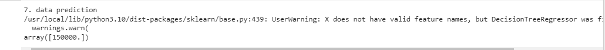

# Implementation-of-Decision-Tree-Regressor-Model-for-Predicting-the-Salary-of-the-Employee

## AIM:
To write a program to implement the Decision Tree Regressor Model for Predicting the Salary of the Employee.

## Equipments Required:
1. Hardware – PCs
2. Anaconda – Python 3.7 Installation / Jupyter notebook

## Algorithm
1. Import dataset and get dataset info
2. Ceck for null values
3. Map values for position column
4. Split training data and test data
5. Import decision tree regressor and fit it for data
6. Calculate mse r2 and y_predict

## Program:
```
/*
Program to implement the Decision Tree Regressor Model for Predicting the Salary of the Employee.
Developed by: Sowjanya S
RegisterNumber: 212220040158
*/
import pandas as pd
df=pd.read_csv('/content/Salary.csv')
print("1. data.head()")
df.head()
print("2. df.info()")
df.info()
print("3. isnull() and sum()")
df.isnull().sum()
from sklearn.preprocessing import LabelEncoder
le=LabelEncoder()
df["Position"]=le.fit_transform(df["Position"])
print("4. data.head() for salary ")
df.head()
print("5. MSE value")
x=df[["Position","Level"]]
y=df[["Salary"]]
from sklearn.model_selection import train_test_split
x_train,x_test,y_train,y_test=train_test_split(x,y,test_size=0.2,random_state=2)
from sklearn.tree import DecisionTreeRegressor
dt=DecisionTreeRegressor()
dt.fit(x_train,y_train)
y_pred=dt.predict(x_test)
from sklearn import metrics
mse=metrics.mean_squared_error(y_test,y_pred)
mse
print("6. r2 value")
r2=metrics.r2_score(y_test,y_pred)
r2
print("7. data prediction")
dt.predict([[5,6]])
```

## Output:





## Result:
Thus the program to implement the Decision Tree Regressor Model for Predicting the Salary of the Employee is written and verified using python programming.
